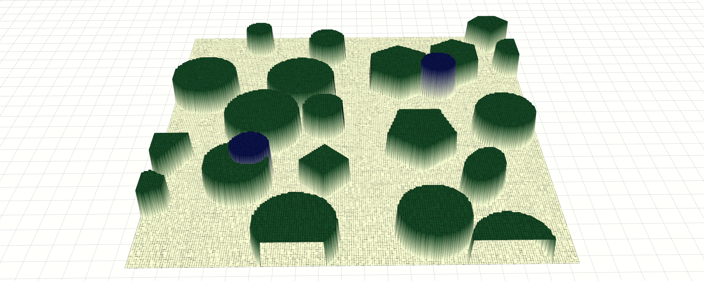

# README.md

<div align="center" style="margin: 20px 0;">
  
</div>

## 一. 项目作用
发布一个带有静态和动态障碍物的grid_map ros 消息用于路径搜索
- [TODO]支持通过launch文件设置参数
- 支持设置随机的静态和动态障碍


## 二. 环境安装
> 此设置已在 **Ubuntu 20.04** 和 **ros1 noetic** 上通过测试。

### 2.1 克隆带有子模块的仓库
```bash
sudo apt install ros-noetic-grid-map
mkdir -p catkin_ws/src 
git clone git@github.com:Tipriest/map_generator.git ./catkin_ws/src
```

### 2.2 编译
```bash
catkin build
```


## 三. 仿真环境使用
```bash
roslaunch map_generator optimize_visual.launch
```
