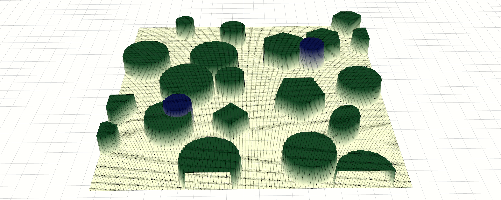

# README.md

<div align="center" style="margin: 20px 0;">
  
</div>

## 一. 项目作用
发布一个带有静态和动态障碍物的grid_map ROS2 消息用于路径搜索
- [TODO]支持通过launch文件设置参数
- 支持设置随机的静态和动态障碍


## 二. 环境安装
> 此设置已在 **Ubuntu 22.04** 和 **ROS2 Humble** 上通过测试。

### 2.1 安装依赖
```bash
sudo apt install ros-humble-grid-map-ros ros-humble-grid-map-rviz-plugin
```

### 2.2 克隆仓库
```bash
mkdir -p ~/ros2_ws/src
cd ~/ros2_ws/src
git clone git@github.com:Tipriest/map_generator.git
```

### 2.3 编译
```bash
cd ~/ros2_ws
colcon build --packages-select map_generator
source install/setup.bash
```


## 三. 仿真环境使用
```bash
ros2 launch map_generator optimize_visual.launch.py
```
